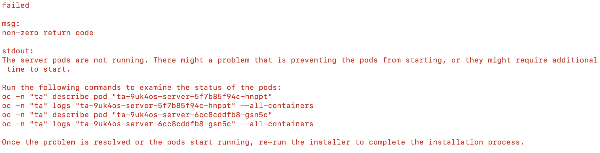
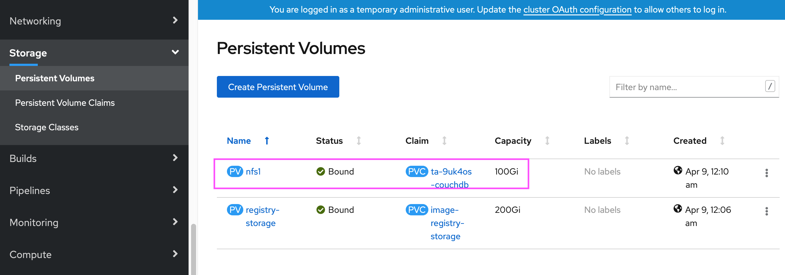
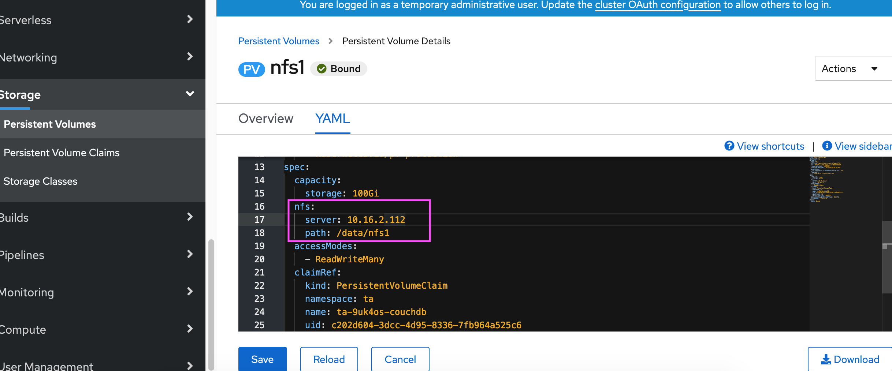
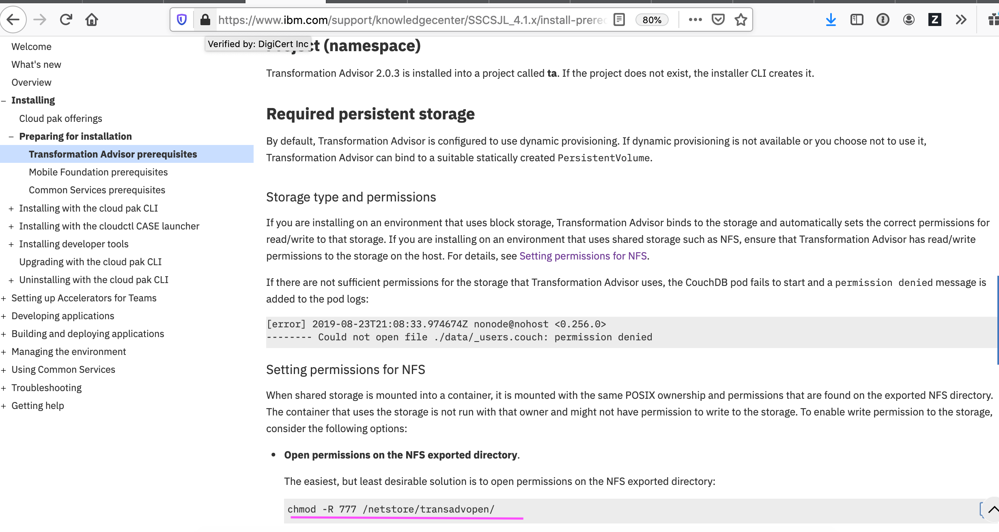

# CP4Apps Install failed with ta error.

## 1. Error Text 

stdout: 
All couchdb pods are running.

Check For Transformation Advisor Server...
  Retrying... (1 of 41)
  Retrying... (2 of 41)
  Retrying... (3 of 41)
  Retrying... (4 of 41)
  Retrying... (5 of 41)
  Retrying... (6 of 41)
  Retrying... (7 of 41)
  Retrying... (8 of 41)
  Retrying... (9 of 41)
  Retrying... (10 of 41)
  Retrying... (11 of 41)
  Retrying... (12 of 41)
  Retrying... (13 of 41)
  Retrying... (14 of 41)
  Retrying... (15 of 41)
  Retrying... (16 of 41)
  Retrying... (17 of 41)
  Retrying... (18 of 41)
  Retrying... (19 of 41)
  Retrying... (20 of 41)
  Retrying... (21 of 41)
  Retrying... (22 of 41)
  Retrying... (23 of 41)
  Retrying... (24 of 41)
  Retrying... (25 of 41)
  Retrying... (26 of 41)
  Retrying... (27 of 41)
  Retrying... (28 of 41)
  Retrying... (29 of 41)
  Retrying... (30 of 41)
  Retrying... (31 of 41)
  Retrying... (32 of 41)
  Retrying... (33 of 41)
  Retrying... (34 of 41)
  Retrying... (35 of 41)
  Retrying... (36 of 41)
  Retrying... (37 of 41)
  Retrying... (38 of 41)
  Retrying... (39 of 41)
  Retrying... (40 of 41)
failed

msg: 
non-zero return code

stdout: 
The server pods are not running. There might a problem that is preventing the pods from starting, or they might require additional time to start.

Run the following commands to examine the status of the pods:
oc -n "ta" describe pod "ta-9uk4os-server-5f7b85f94c-hnppt"
oc -n "ta" logs "ta-9uk4os-server-5f7b85f94c-hnppt" --all-containers
oc -n "ta" describe pod "ta-9uk4os-server-6cc8cddfb8-gsn5c"
oc -n "ta" logs "ta-9uk4os-server-6cc8cddfb8-gsn5c" --all-containers

Once the problem is resolved or the pods start running, re-run the installer to complete the installation process.

## 2. Error Images



## 3. Solution

1. Find the nfs path of the TV for couchdb




2. ssh into Infra
```
 ssh -v root@1.2.3.4
```

3. Set the permission

```
 chmod -R 777 /data/nfs1
```

4. Pod should be started initializing from CrashLooBackOff status

```
Jeyas-MacBook-Pro:install-ganocp43 jeyagandhi$ oc get pods
NAME                                 READY   STATUS    RESTARTS   AGE
ta-9uk4os-couchdb-58845b6bcc-w598t   1/1     Running   17         80m
ta-9uk4os-server-5f7b85f94c-hnppt    1/1     Running   0          24m
ta-9uk4os-ui-779b58886f-clrnl        1/1     Running   0          24m
ta-operator-69777b47c8-nrtm4         1/1     Running   0          87m
```

## 4. Solution Images


## 5. Tips

https://www.ibm.com/support/knowledgecenter/SSCSJL_4.1.x/install-prerequisites-ta.html#permissions-nfs



